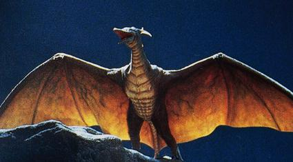

#Kaiju

Wikipedia article summary:

> "Kaiju (Japanese: 怪獣, Hepburn: kaijū, lit. "strange beast") is a Japanese genre of films featuring giant monsters. The term kaiju (which comes from the Chinese text Classic of Mountains and Seas) can refer to the giant monsters themselves, which are usually depicted attacking major cities and engaging the military, or other kaiju, in battle. The kaiju genre is a subgenre of tokusatsu (特撮, "special filming") entertainment."

---
In this context, **Kaiju** is a collection of tools for analyzing and working with Atlassian tools, predominantly Jira.

If Godzilla > Gojira > Jira, then Kaiju represent Mothra, Rodan and Mechagodzilla.

---
